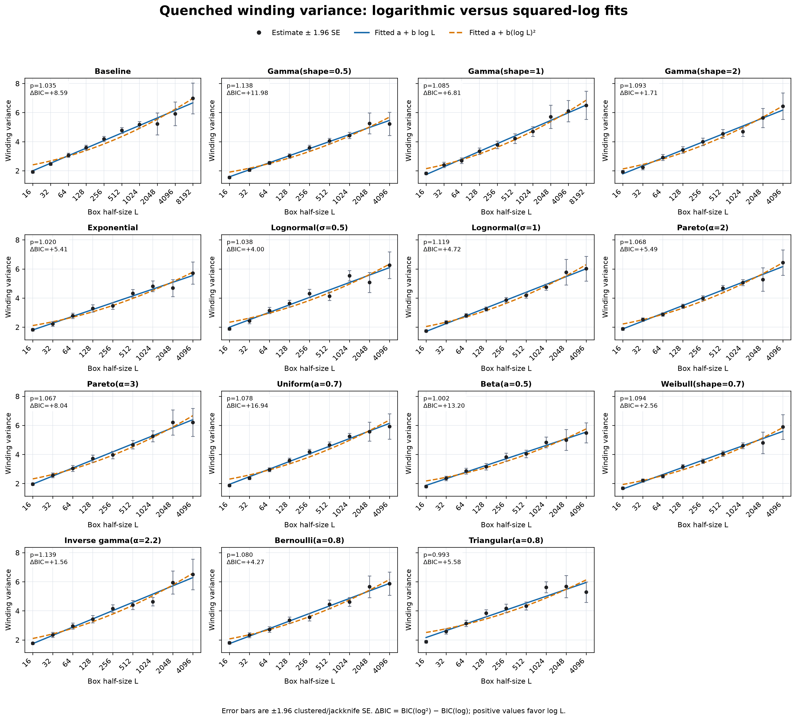
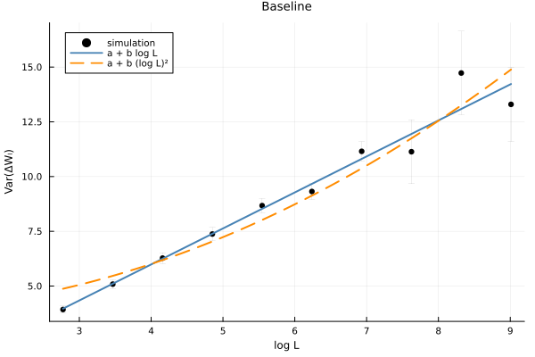
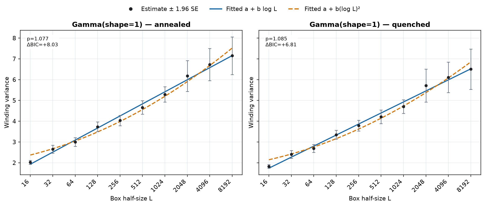
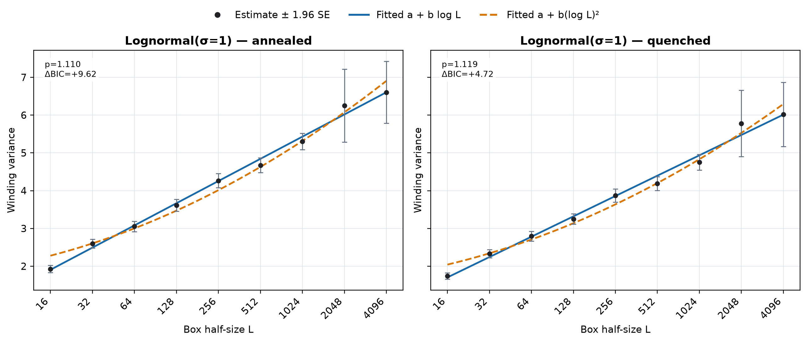
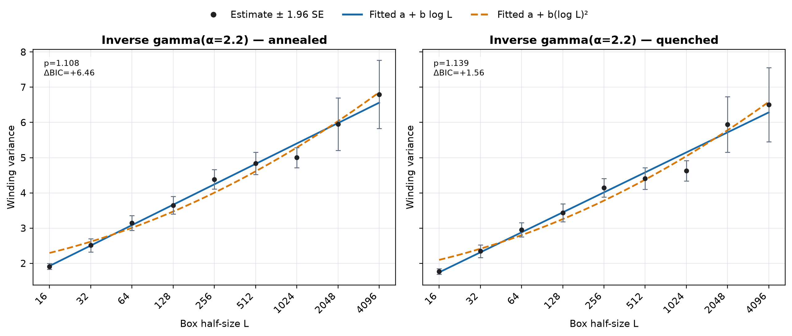

# High-Performance Monte Carlo for Loop-Erased Random Walks

**A reproducible Julia study of winding fluctuations in quenched random environments.**

[](https://github.com/albystack/lerw-random-environment-research/actions/workflows/ci.yml)

This project combines probability, Monte Carlo simulation, statistical model
comparison, performance engineering, and HPC workflows. The central question is
whether local random disorder changes the winding variance of loop-erased random
walks (LERW) from ordinary logarithmic roughness,

```math
Var(W_L) ~ C log(L)
```

to the conjectured super-rough regime,

```math
Var(W_L) ~ C (log(L))^2
```

[Results](#results) · [Visual evidence](#visual-evidence) ·
[Run locally](#run-locally) · [Method](#the-model-in-30-seconds) ·
[Repository guide](#repository-guide)

---

## At a glance

| | |
|---|---:|
| Simulated walks | **379,000** |
| Random-weight specifications | **15** |
| Lattice scales | **$L=16$ to $L=8192$** |
| Validated batch files | **3,215 / 3,215** |
| Automated tests | **63 passing (49 Julia, 14 Python)** |
| Main implementation | **Julia** |

The numerical evidence consistently supports ordinary logarithmic growth over
the simulated range. It does **not** provide evidence for $(\log L)^2$ growth.
All fifteen specifications cover $L=16$ through $L=4096$; the baseline and
Gamma(shape=1) experiments extend to $L=8192$.

## Results

The exponent is estimated from

$$
\log \operatorname{Var}(W_L) = \log C + p\log\log L.
$$

Thus $p=1$ corresponds to $C\log L$, while $p=2$ corresponds to
$C(\log L)^2$.

| Experiment | Fitted $p$ | Clustered-bootstrap 95% CI |
|---|---:|---:|
| Baseline, annealed | **1.045** | **[0.968, 1.112]** |
| Gamma(shape=1), annealed | **1.077** | **[0.999, 1.149]** |
| Baseline, quenched | **1.035** | **[0.947, 1.118]** |
| Gamma(shape=1), quenched | **1.085** | **[0.993, 1.160]** |

Across all distributions:

- every fitted exponent is much closer to $1$ than to $2$;
- the largest bootstrap upper endpoint is **1.23**;
- all **15/15 annealed** and **15/15 quenched** BIC comparisons favor
  $a+b\log L$ over $a+b(\log L)^2$;
- the conclusion is unchanged across bounded, light-tailed, and heavy-tailed
  weight families.

These are finite-size computational results, not an asymptotic proof.

## Visual evidence

### All distributions: annealed variance

Black points are variance estimates with $\pm1.96$ clustered/jackknife standard
errors. Blue curves fit $a+b\log L$; orange dashed curves fit
$a+b(\log L)^2$.

<p align="center">
  
</p>

### All distributions: quenched variance

<p align="center">
  
</p>

### Exponent estimates

The green reference line is $p=1$; the red dashed line is $p=2$. Confidence
intervals cluster tightly around logarithmic scaling.

<p align="center">
  
</p>

### Direct model comparison

Here $\Delta\mathrm{BIC}=\mathrm{BIC}(\log^2)-\mathrm{BIC}(\log)$. Positive
values favor ordinary logarithmic growth.

<p align="center">
  
</p>

### Selected detailed views

| Baseline | Gamma(shape=1) |
|---|---|
|  |  |
| Lognormal($\sigma=1$) | Inverse gamma($\alpha=2.2$) |
|  |  |

Presentation-ready files:

- [Four-page research overview](reports/figures/research_scaling_overview.pdf)
- [Detailed 15-page distribution report](reports/figures/all_distributions_detailed.pdf)
- [All aggregate result tables](reports/)

## The model in 30 seconds

The walk starts at the origin in the square $[-L,L]^2$. Every site receives
four independent positive outgoing weights, one for each compass direction.
Those weights are fixed within a quenched environment and converted into local
transition probabilities. The walk stops on first hitting the boundary.

Chronological loop erasure is maintained online. The final observable is the
number of left quarter-turns minus right quarter-turns along the loop-erased
path.


### Annealed versus quenched

- **Annealed variance** pools walks across random environments.
- **Quenched variance** computes within-environment variance first, then
  averages across environments.

Walks sharing an environment are correlated. Confidence intervals therefore
resample complete environments rather than incorrectly treating every walk as
independent.

## Technical highlights

This repository was designed as a research pipeline rather than a one-off
notebook.

- **Fast simulation:** packed 64-bit lattice coordinates, online loop erasure,
  bounded site caches, and multithreading across independent environments.
- **Memory control:** deterministic point-addressed weights allow evicted cache
  entries to be regenerated exactly at large $L$.
- **Reproducibility:** stable seeds, source fingerprints, Julia-version
  metadata, atomic CSV writes, and restart-safe task detection.
- **Statistical rigor:** environment-clustered bootstrap intervals,
  cluster-jackknife standard errors, local effective exponents, and BIC/AIC
  model comparisons.
- **Scalable execution:** local multicore runs and Slurm array jobs use the same
  configuration-driven batch interface.
- **Cross-language validation:** archived Python results and optimized Julia
  results are combined through a schema-aware analysis pipeline.

## Run locally

### Requirements

- Julia 1.10 or newer
- Git
- Optional for figures: Python 3 with Matplotlib, pandas, and NumPy

### 1. Install and test

```bash
git clone https://github.com/albystack/lerw-random-environment-research.git research
cd research/research-julia

julia --project=. -e 'using Pkg; Pkg.instantiate(); Pkg.precompile()'
julia --project=. -e 'using Pkg; Pkg.test()'
```

### 2. Run the smoke experiment

```bash
for task in 0 1 2 3; do
  julia --threads=auto --project=. scripts/run_batch.jl \
    --task-id "$task" \
    --config configs/hpc_smoke.csv \
    --output-dir results_hpc_smoke
done
```

### 3. Analyse it

```bash
julia --project=. scripts/analyze_results.jl \
  --config configs/hpc_smoke.csv \
  --results-dir results_hpc_smoke \
  --output-dir analysis_hpc_smoke \
  --bootstrap-reps 100
```

The analysis writes:

```text
summary.csv
loglog_fits.csv
scaling_model_comparison.csv
local_effective_exponents.csv
pointwise_ratios.csv
validation.csv
```

### 4. Generate figures

```bash
python3 -m venv .plot-venv
source .plot-venv/bin/activate
python -m pip install matplotlib pandas numpy

python scripts/plot_scaling_results.py \
  --analysis-dir ../reports \
  --output-dir figures_reproduced
```

For the complete workflow, see
[research-julia/README.md](research-julia/README.md). For Slurm usage,
see [research-julia/HPC_README.md](research-julia/HPC_README.md).

## Configure a new experiment

Experiment grids are ordinary CSV files. For example:

```bash
julia --project=. scripts/generate_config.jl \
  --output configs/custom_large.csv \
  --sizes 1024,2048,4096 \
  --distributions baseline,gamma:0.5,lognormal:1.0,pareto:2.0 \
  --batches 20 \
  --num-environments 10 \
  --walks-per-environment 5
```

Time one task at each new size before submitting the full grid. Disordered
environments can use approximately 320 MiB of site-cache memory per active
Julia thread at the largest scales.

## Weight distributions

The study covers:

```text
Baseline
Gamma(0.5, 1, 2)       Exponential       Weibull(0.7)
Lognormal(0.5, 1)      Pareto(2, 3)      Inverse gamma(2.2)
Uniform(0.7)           Beta(0.5)         Bernoulli(0.8)
Triangular(0.8)
```

Each positive-weight family is normalized to have mean one before local
transition probabilities are formed.

## Repository guide

```text
research/
├── research-julia/          active simulation and analysis package
│   ├── src/                 model, loop erasure, batching, statistics
│   ├── scripts/             command-line runners and plotting
│   ├── configs/             reproducible experiment grids
│   ├── test/                automated tests
│   └── slurm/               HPC array and analysis jobs
├── research-python/         archived first implementation
├── reports/                 compact aggregate tables and figures
└── reports/figures/         presentation-ready figures and PDFs
```

## Reproducibility and data

- Batch outputs are written atomically and completed tasks are skipped.
- Result rows contain task, seed, code, runtime, path, exit, and status metadata.
- The analysis rejects missing, partial, failed, or duplicate tasks by default.
- Aggregate tables and figures are included in Git.
- Raw walk-level data are excluded because of their size; a versioned archive
  should accompany any formal release.

## Scope and next steps

The simulations provide strong evidence against $(\log L)^2$ behavior over the
tested finite-size range. They do not prove the asymptotic law.

The main conceptual check before extending the campaign is whether the intended
mathematical object uses **directed site weights**, as implemented here, or
**reversible undirected edge weights**. If additional computation is needed,
the highest-value extension is a targeted $L=8192$ or $L=16384$ run for the few
largest-uncertainty distributions rather than rerunning all fifteen cases.

---

Developed by **Alberto Rescigno** as an independent computational probability
research project.
