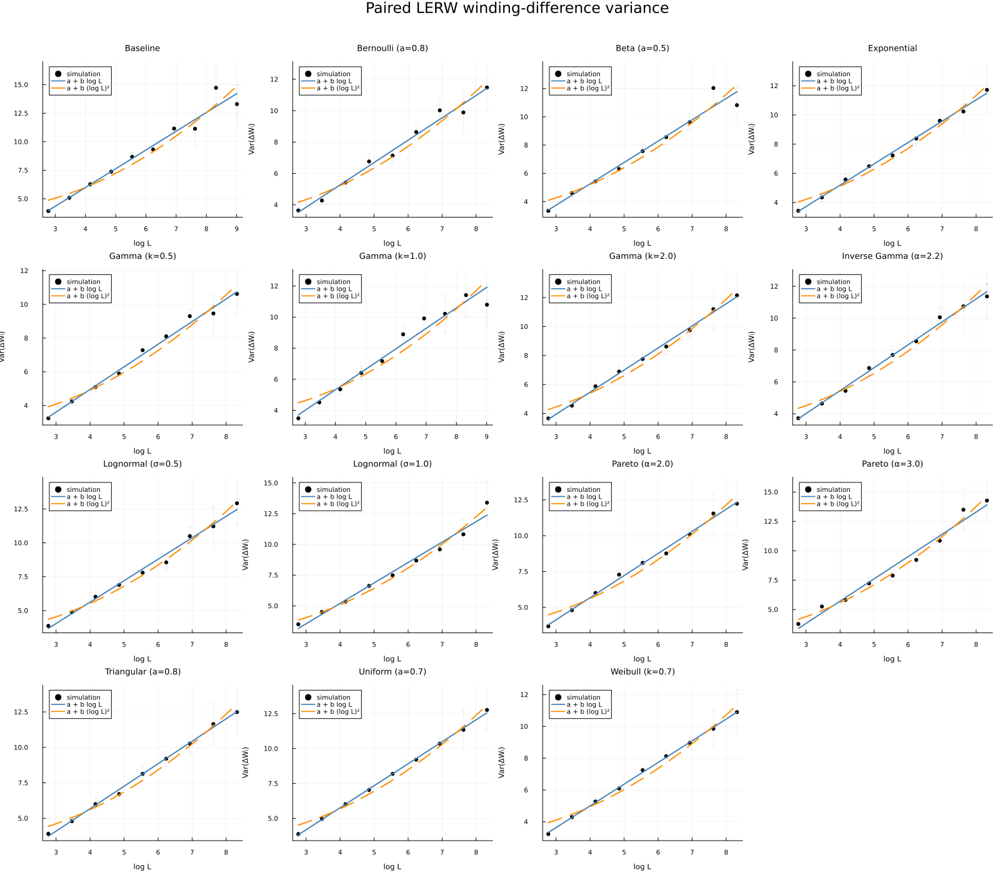
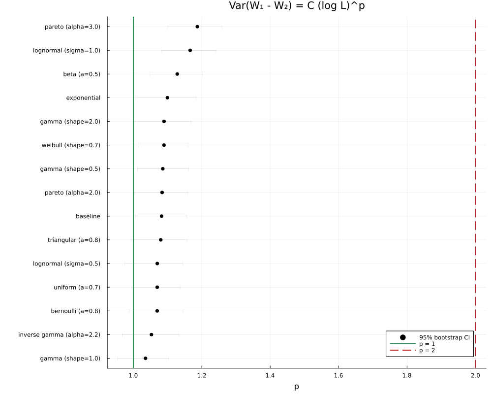
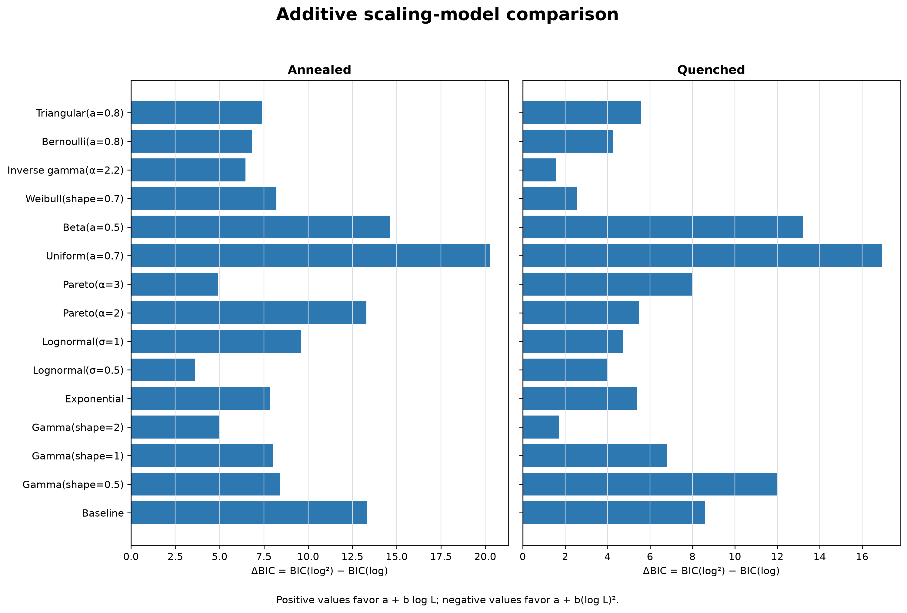

# Winding fluctuations of loop-erased random walks

A computational study of loop-erased random walks (LERWs) in random
environments. The central question is whether local disorder changes the
winding variance from logarithmic growth,

```math
\mathrm{Var}(W_L) \sim C\log L,
```

to a squared-logarithmic regime,

```math
\mathrm{Var}(W_L) \sim C(\log L)^2.
```

## Model

A walk starts at the origin and stops when it reaches the boundary of
the square \([-L,L]^2\). At each lattice site \(x\), four independent positive
weights \(w_{x,d}\) determine the next step:

```math
\mathbb P(X_{n+1}=x+e_d\mid X_n=x,\omega)
=\frac{w_{x,d}}{\sum_{d'}w_{x,d'}}.
```

Loops are erased chronologically. Along the resulting self-avoiding path,
\(W_L\) is the number of left quarter-turns minus right quarter-turns; the
angular winding is \(\Theta_L=(\pi/2)W_L\).

The simulations cover 15 bounded, light-tailed, and heavy-tailed weight
specifications. Two observables are studied:

- one LERW in each independent environment;
- a pair of conditionally independent LERWs in the same environment, with
  \(\Delta W_L=W_L^{(1)}-W_L^{(2)}\).

Two directed environment modes are implemented:

- `site_iid` is the original model. Four weights are fixed at each site and
  reused on every revisit.
- `temporal_iid` redraws four independent weights at every raw walk step.
  Every temporal realisation contains exactly one walk and is analysed only as
  an independent annealed observation.

The original LERW study remains under `julia/`. The follow-up weighted
Aztec-diamond sampler is isolated under `aztec/`.

## Results

The effective exponent is fitted through

```math
\mathrm{Var}(W_L)=C(\log L)^p,
\qquad
\log\mathrm{Var}(W_L)=\log C+p\log\log L.
```

Thus \(p=1\) represents logarithmic growth and \(p=2\) squared-logarithmic
growth.

| Experiment | Sample | Fitted \(p\) across 15 specifications | Log model preferred by BIC |
|---|---:|---:|---:|
| Single walk | 379,000 environments and walks | 1.011–1.160 | 14/15 |
| Paired walks | 379,000 environments, 758,000 walks | 1.036–1.187 | 12/15 |

Every bootstrap confidence interval remains far below \(p=2\). Over the
simulated range \(L=16,\ldots,8192\), both experiments therefore show no robust
evidence for squared-logarithmic growth. These are finite-size Monte Carlo
results, not an asymptotic proof.

The tables and figures in [`reports/`](reports/) show the completed paired-walk
experiment. Raw batch files and the earlier single-walk results are preserved
in [`legacy/`](legacy/).

### Paired winding variance

Points are variance estimates with 95% error bars. The blue and orange curves
fit \(a+b\log L\) and \(a+b(\log L)^2\), respectively.

<p align="center">
  
</p>

### Effective exponents

The green line marks \(p=1\); the dashed red line marks \(p=2\).

<p align="center">
  
</p>

### Direct model comparison

Positive \(\Delta\mathrm{BIC}=\mathrm{BIC}(\log^2)-\mathrm{BIC}(\log)\)
favors ordinary logarithmic growth.

<p align="center">
  
</p>

## Setup

Julia 1.10 or newer is required.

```bash
git clone https://github.com/albystack/lerw-random-environment-research.git
cd lerw-random-environment-research/julia

julia --project=. -e 'using Pkg; Pkg.instantiate(); Pkg.precompile()'
```

The simulation, analysis, and plotting entry points are in [`julia/scripts/`](julia/scripts/).

## Random-weight Aztec-diamond follow-up

The self-contained [`aztec/`](aztec/) workflow reproduces Sunil Chhita's
supplied 2022 domino-shuffling code for an order-200 diamond with a saved
`400 × 400` table of i.i.d. `Uniform(0,1)` weights. It uses a fixed seed,
validates exact coverage of all 80,400 cells, and exports both the old
Mathematica-compatible binary matrix and a directly viewable SVG:

```bash
julia --startup-file=no aztec/test/runtests.jl
julia --startup-file=no aztec/scripts/run_random_weights.jl
julia --startup-file=no aztec/scripts/run_gamma_disordered.jl
```

See [`aztec/README.md`](aztec/README.md) for the precise matrix convention,
the i.i.d.-Uniform run, the Duits–Van Peski Gamma-disordered run, output
files, and the optional Mathematica renderer.

## Temporal-i.i.d. pilot

The frozen 46,000-walk pilot is
[`julia/configs/temporal_iid_pilot.csv`](julia/configs/temporal_iid_pilot.csv).
From `julia/`, reproduce its validation and outputs with:

```bash
julia --project=. -e 'using Pkg; Pkg.test()'
JULIA_NUM_THREADS=auto julia --project=. scripts/run_campaign.jl \
  --config configs/temporal_iid_smoke.csv \
  --output-dir results_julia_temporal_smoke

/usr/bin/time -l env JULIA_NUM_THREADS=auto julia --project=. \
  scripts/run_batch.jl --config configs/temporal_iid_benchmark.csv \
  --task-id 0 --output-dir results_julia_temporal_benchmark
/usr/bin/time -l env JULIA_NUM_THREADS=auto julia --project=. \
  scripts/run_batch.jl --config configs/temporal_iid_benchmark.csv \
  --task-id 1 --output-dir results_julia_temporal_benchmark
/usr/bin/time -l env JULIA_NUM_THREADS=auto julia --project=. \
  scripts/run_batch.jl --config configs/temporal_iid_benchmark.csv \
  --task-id 2 --output-dir results_julia_temporal_benchmark

JULIA_NUM_THREADS=auto julia --project=. scripts/run_campaign.jl \
  --config configs/temporal_iid_pilot.csv \
  --output-dir results_julia_temporal_pilot
JULIA_NUM_THREADS=auto julia --project=. scripts/analyze_results.jl \
  --config configs/temporal_iid_pilot.csv \
  --results-dir results_julia_temporal_pilot \
  --output-dir analysis_temporal_pilot \
  --bootstrap-reps 1000 --bootstrap-seed 20260726
julia --project=. scripts/plot_results.jl \
  --analysis-dir analysis_temporal_pilot \
  --output-dir figures_temporal_pilot
```

Generated raw results, analysis tables, and figures are ignored runtime
artifacts; the frozen configurations and source code are tracked.

## Temporal Gamma LERW-length extension

The length observable is the number of edges in the online loop-erased path.
Its scaling exponent is fitted from

```math
\log E[|\mathrm{LERW}_L|] = \log C + d\log L.
```

The dedicated Gamma(shape \(0.5\)) campaign reuses the existing pilot through
\(L=1024\), adds 100 independent walks at each of
\(L=2048,4096,5000,8192\), and writes pointwise ratios, local exponents, and a
bootstrap confidence interval for \(d\):

```bash
julia --project=. scripts/generate_config.jl \
  --preset temporal_iid_gamma_length \
  --output configs/temporal_iid_gamma_length.csv \
  --extension-walks 100
JULIA_NUM_THREADS=auto julia --project=. scripts/run_campaign.jl \
  --config configs/temporal_iid_gamma_length.csv \
  --output-dir results_julia_temporal_pilot
JULIA_NUM_THREADS=auto julia --project=. scripts/analyze_results.jl \
  --config configs/temporal_iid_gamma_length.csv \
  --results-dir results_julia_temporal_pilot \
  --output-dir analysis_temporal_gamma_length \
  --bootstrap-reps 2000 --bootstrap-seed 20260727
```
