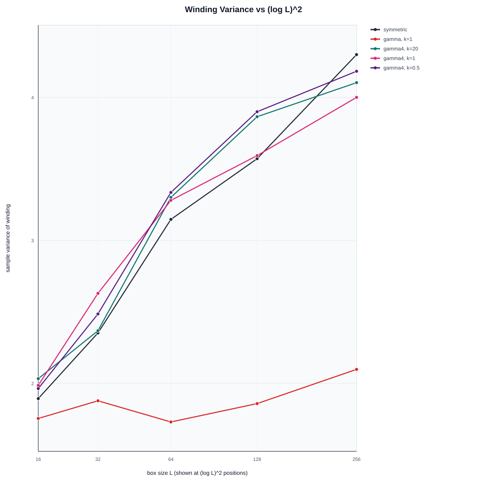
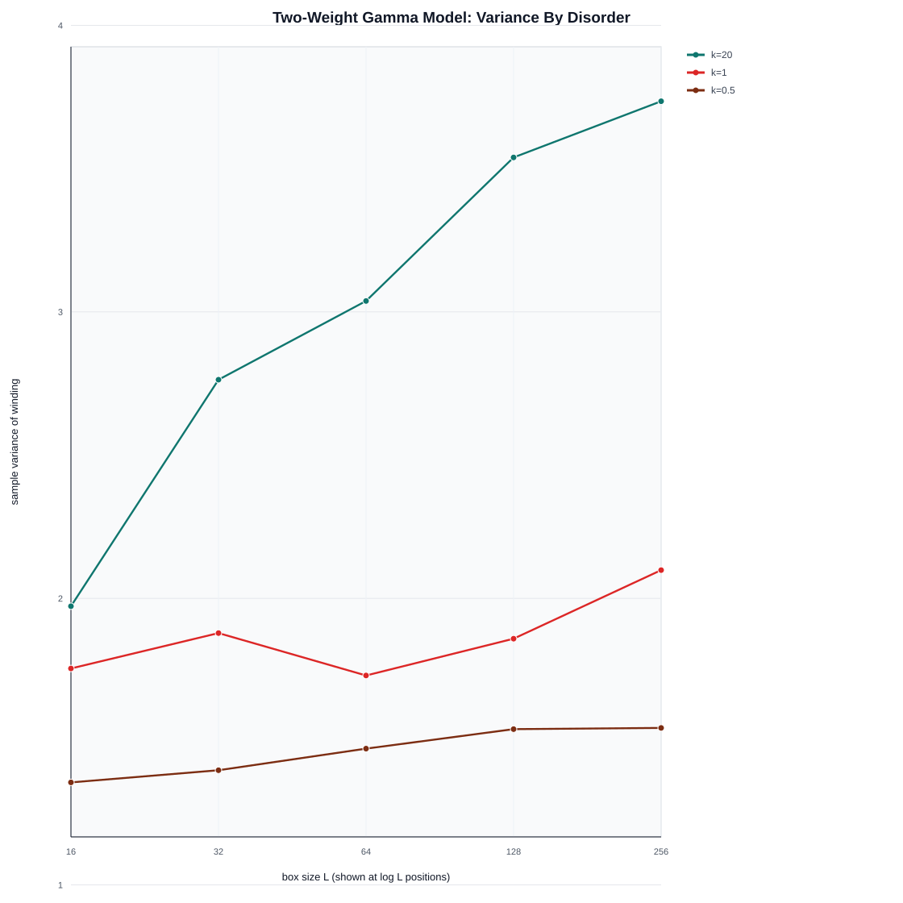
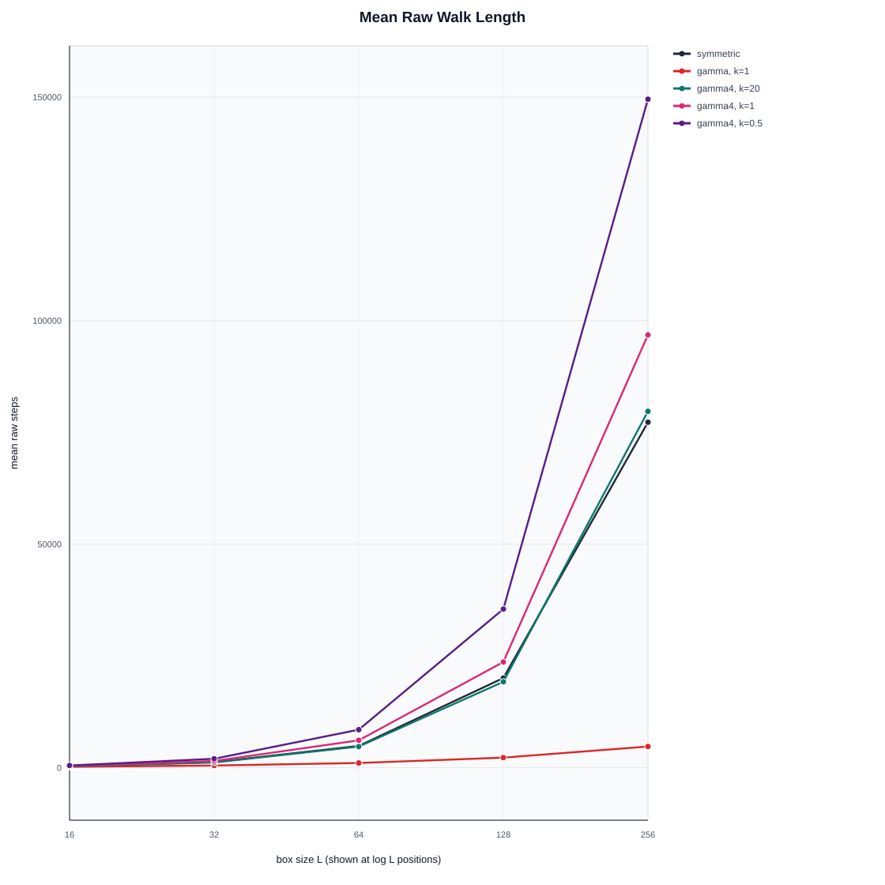
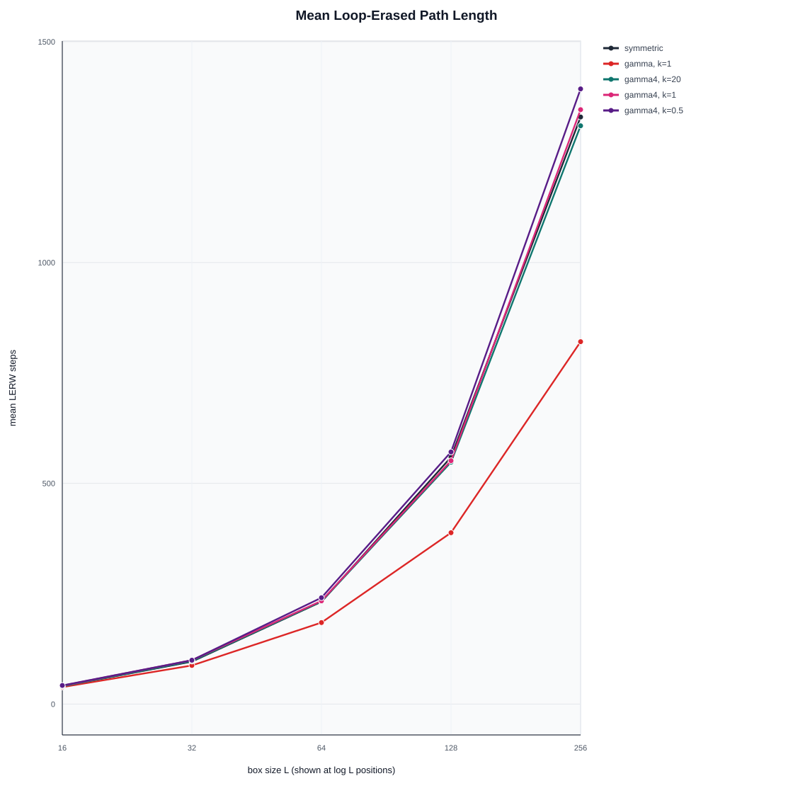
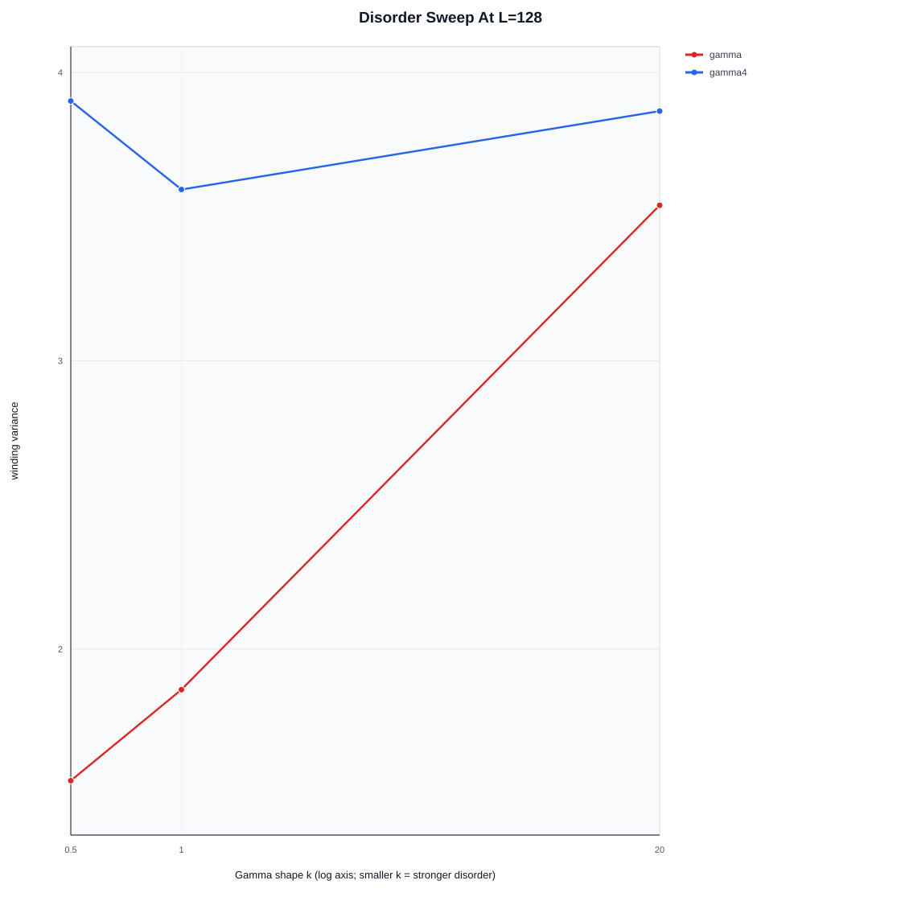
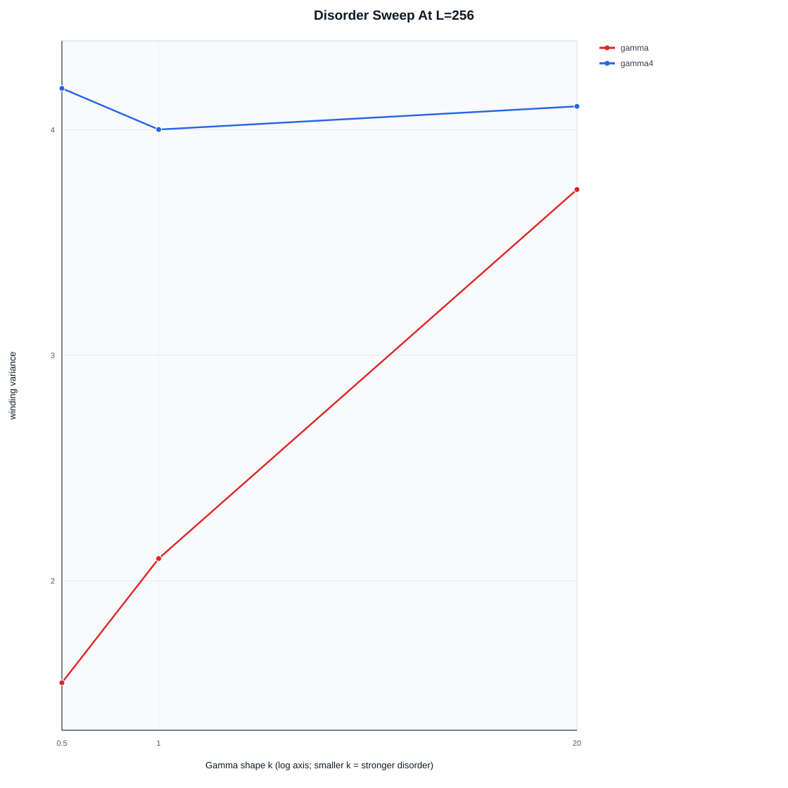
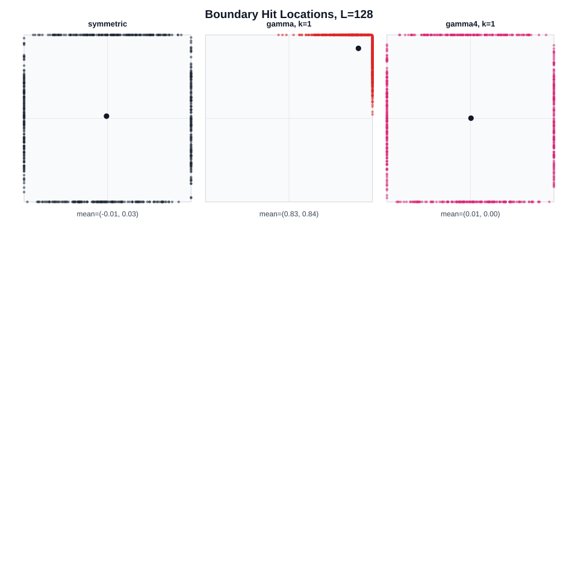
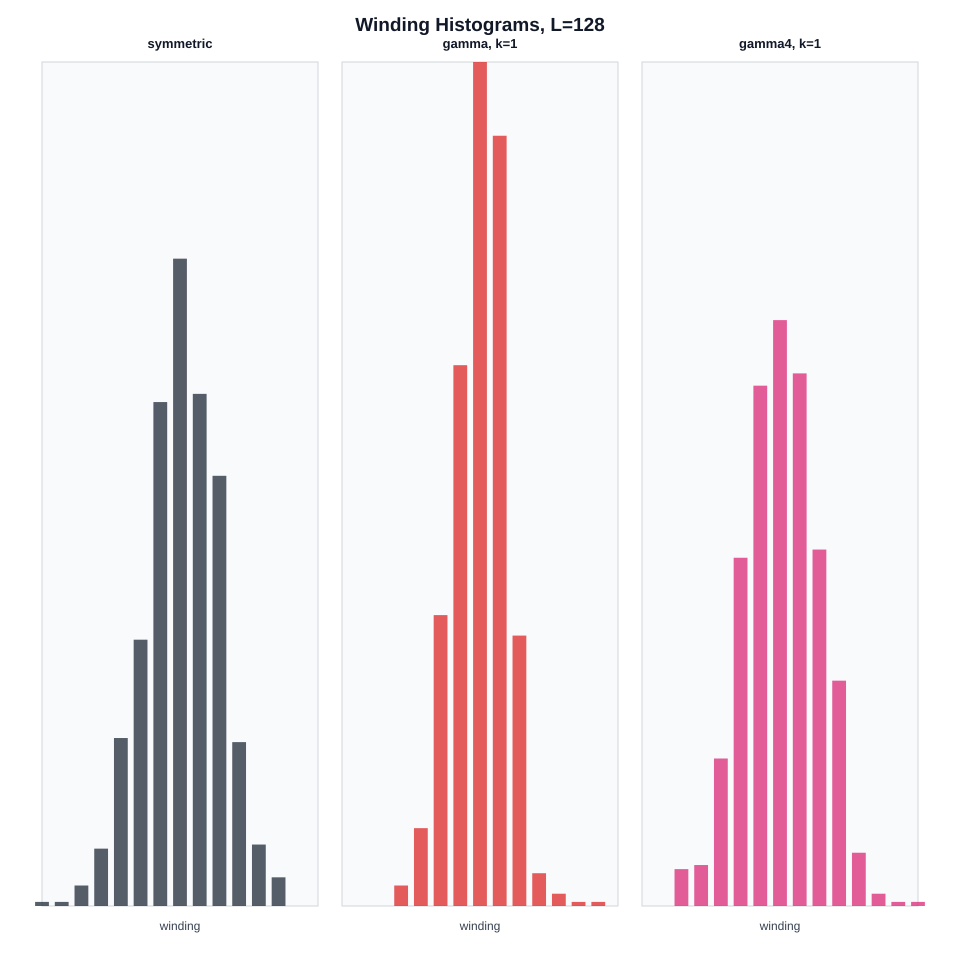
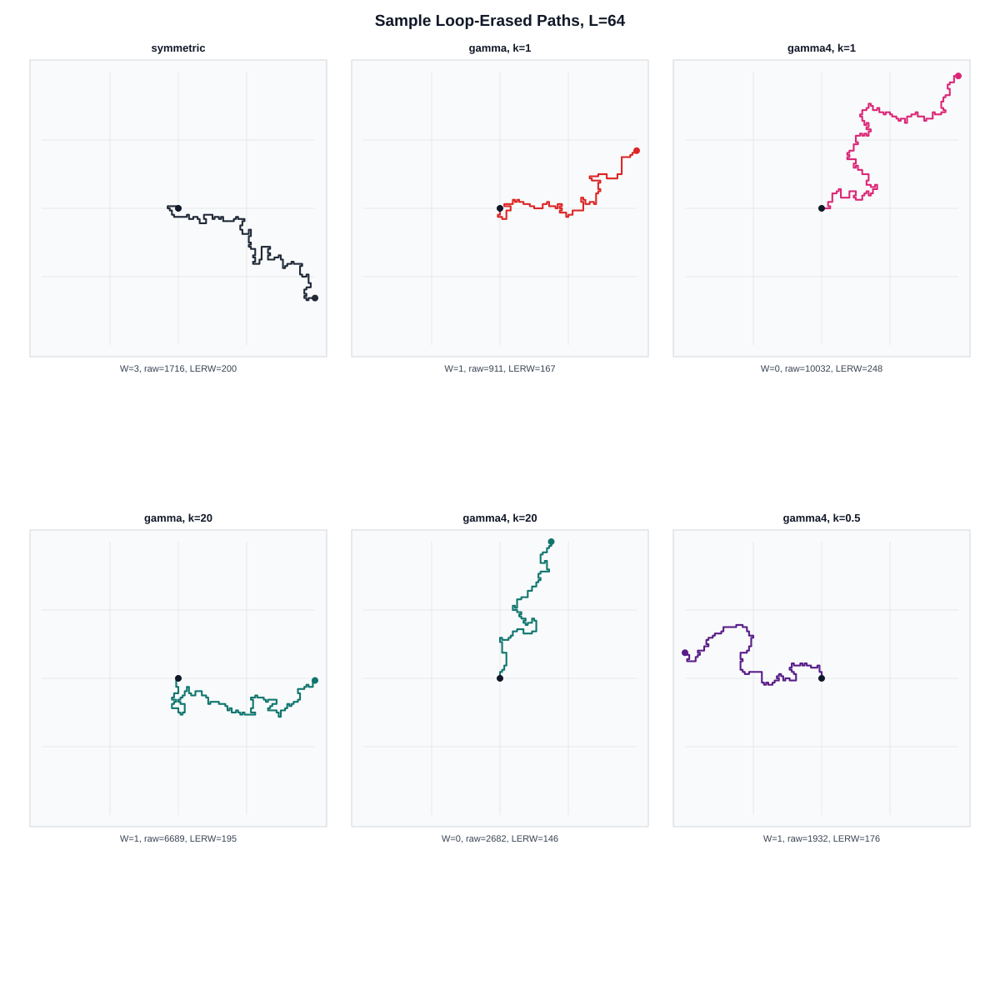

# Numerical Analysis Dossier

Source data: `results/research_batch_focused.csv`

## Dataset

- Models: gamma, gamma4, symmetric
- Box sizes: 16, 32, 64, 128, 256
- Total grouped cells: 35

## Main Diagnostics

- `symmetric` k=None at L=256: Var(W)=4.300, mean W=0.101, mean hit/L=(-0.018, -0.044), mean raw steps=77271.2.
- `gamma` k=1.0 at L=256: Var(W)=2.099, mean W=-0.010, mean hit/L=(0.894, 0.889), mean raw steps=4731.9.
- `gamma4` k=1.0 at L=256: Var(W)=4.001, mean W=0.016, mean hit/L=(0.028, 0.026), mean raw steps=96802.5.

The two-random-weight `gamma` model should be treated carefully: the boundary-hit diagnostics measure whether the normalised probabilities create an effective drift. The `gamma4` model is a balanced comparison, not a replacement for the supervisor-suggested model.

## Scaling Fits

The fits below are linear regressions of winding variance against either `log L` or `(log L)^2`. They are descriptive diagnostics, not proof of asymptotic scaling.

| model | k | fit | slope | intercept | R^2 | RSS |
|---|---:|---|---:|---:|---:|---:|
| gamma | 0.5 | logL | 0.07554 | 1.151 | 0.9500 | 0.001443 |
| gamma | 0.5 | logL_squared | 0.008874 | 1.303 | 0.9159 | 0.002427 |
| gamma | 1.0 | logL | 0.09622 | 1.464 | 0.5244 | 0.04034 |
| gamma | 1.0 | logL_squared | 0.01218 | 1.642 | 0.5874 | 0.03499 |
| gamma | 20.0 | logL | 0.6205 | 0.4292 | 0.9517 | 0.09381 |
| gamma | 20.0 | logL_squared | 0.0725 | 1.686 | 0.9077 | 0.1793 |
| gamma4 | 0.5 | logL | 0.8443 | -0.3372 | 0.9760 | 0.0841 |
| gamma4 | 0.5 | logL_squared | 0.09944 | 1.359 | 0.9458 | 0.1903 |
| gamma4 | 1.0 | logL | 0.7201 | 0.1036 | 0.9780 | 0.05608 |
| gamma4 | 1.0 | logL_squared | 0.08459 | 1.554 | 0.9426 | 0.1463 |
| gamma4 | 20.0 | logL | 0.8133 | -0.2477 | 0.9630 | 0.1222 |
| gamma4 | 20.0 | logL_squared | 0.09603 | 1.381 | 0.9379 | 0.2049 |
| symmetric | None | logL | 0.87 | -0.5646 | 0.9920 | 0.02931 |
| symmetric | None | logL_squared | 0.1038 | 1.158 | 0.9870 | 0.04749 |

## Figures

## Preliminary Interpretation

- The symmetric baseline is the calibration case and should show roughly logarithmic growth, subject to finite-size noise.
- A strong mean boundary-hit displacement indicates effective drift, in which case winding variance may flatten rather than grow like `log L` or `(log L)^2`.
- The balanced `gamma4` diagnostic helps distinguish disorder effects from drift effects.
- The current run should be used to decide which models and size ranges deserve larger sample counts before paper drafting.
