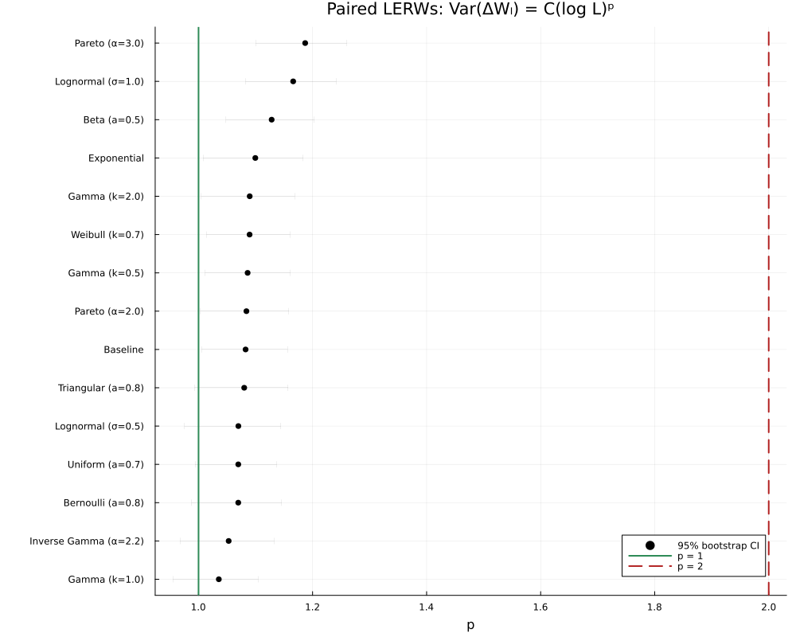

# Loop-erased random walks in random environments

This Julia package studies winding and length observables of planar
loop-erased random walks (LERWs). The main question is whether random local
transition weights change winding variance from

```math
\operatorname{Var}(W_L)\sim C\log L
```

to

```math
\operatorname{Var}(W_L)\sim C(\log L)^2.
```

The retained repository contains the active simulation/analysis code, frozen
experiment configurations and compact result summaries. Large raw batch
archives are intentionally excluded.

## Models

A walk starts at the origin and stops on the boundary of
\([-L,L]^2\). Four positive weights determine its next-step probabilities,
and loops are erased chronologically.

Two environment modes are implemented:

- `site_iid`: four weights are sampled at each visited site and reused on
  every revisit;
- `temporal_iid`: four weights are redrawn independently at every raw step.

The site-i.i.d. study includes both one walk per environment and two
conditionally independent walks in the same environment. The paired
observable is the winding difference
\(\Delta W_L=W_L^{(1)}-W_L^{(2)}\).

## Directory guide

```text
random_walk/
├── Project.toml, Manifest.toml
├── src/                       simulation and statistical analysis
├── scripts/                   command-line entry points
├── test/                      package tests
├── configs/                   frozen temporal experiment schedules
└── results/
    ├── site_iid_single/       one-walk aggregate results
    ├── site_iid_paired/       paired aggregate results and figures
    └── temporal_gamma_length/ refreshed-Gamma validation results
```

## Main retained results

### One walk per fixed environment

The production campaign contains 379,000 walks over 15 weight
specifications. Fitting

```math
\operatorname{Var}(W_L)=C(\log L)^p
```

gives \(p=1.01\)--\(1.16\), with all bootstrap intervals far below \(p=2\).
The affine logarithmic model is preferred by BIC for 14 of 15
specifications.

Tables: [`results/site_iid_single/`](results/site_iid_single/).

### Two walks sharing each environment

The paired campaign contains 758,000 walks arranged in 379,000 shared
environments. Fitted exponents are \(p=1.04\)--\(1.19\); the logarithmic
model is preferred for 12 of 15 specifications.

Tables and figures:
[`results/site_iid_paired/`](results/site_iid_paired/).

<p align="center">
  
</p>

### Temporally refreshed Gamma weights

Redrawing four i.i.d. weights at every step gives unconditional direction
probability \(1/4\), so the annealed walk law is the simple-random-walk law.
The simulations recover the LERW length exponent

```text
d = 1.2518
95% bootstrap interval = [1.2456, 1.2573]
```

consistent with \(E[|\mathrm{LERW}_L|]\propto L^{5/4}\).

Tables:
[`results/temporal_gamma_length/`](results/temporal_gamma_length/).

## Setup and tests

From this directory:

```bash
julia --project=. -e 'using Pkg; Pkg.instantiate(); Pkg.test()'
```

## Run a small campaign

```bash
JULIA_NUM_THREADS=auto julia --project=. scripts/run_campaign.jl \
  --config configs/temporal_iid_smoke.csv \
  --output-dir output/temporal_smoke

julia --project=. scripts/analyze_results.jl \
  --config configs/temporal_iid_smoke.csv \
  --results-dir output/temporal_smoke \
  --output-dir output/temporal_smoke_analysis \
  --bootstrap-reps 200 --bootstrap-seed 20260729
```

Generated output below `output/` is ignored by Git.

## Run the retained temporal-Gamma schedule

```bash
JULIA_NUM_THREADS=auto julia --project=. scripts/run_campaign.jl \
  --config configs/temporal_iid_gamma_length.csv \
  --output-dir output/temporal_gamma

julia --project=. scripts/analyze_results.jl \
  --config configs/temporal_iid_gamma_length.csv \
  --results-dir output/temporal_gamma \
  --output-dir output/temporal_gamma_analysis \
  --bootstrap-reps 2000 --bootstrap-seed 20260727
```

The larger orders are computationally expensive. Batch outputs are
deterministically seeded and restart-safe.

## Generate site-i.i.d. production configurations

The historical raw batches are not stored in this compact repository, but the
production schedules can be regenerated:

```bash
julia --project=. scripts/generate_config.jl \
  --preset strict_annealed_reproduction \
  --output output/site_iid_single_config.csv

julia --project=. scripts/generate_config.jl \
  --preset double_dimer_reproduction \
  --output output/site_iid_paired_config.csv
```

Use `scripts/run_campaign.jl`, followed by `scripts/analyze_results.jl` and
`scripts/plot_results.jl`, with either generated configuration.
