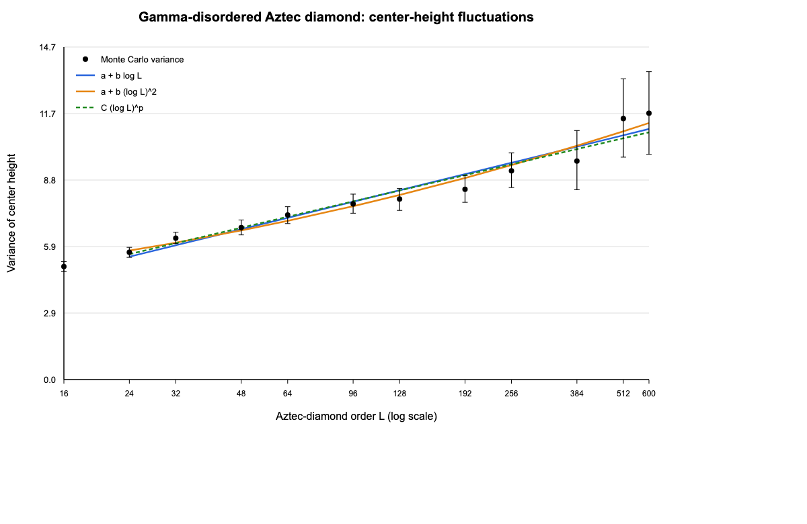

# Random-weight Aztec diamonds

This directory contains a self-contained Julia implementation of weighted
domino shuffling, together with the datasets and numerical results used for
the central-height experiment.

No external Julia packages are required.

## What is implemented

The sampler follows the deletion, sliding and creation workflow in Sunil
Chhita's supplied 2022 Julia code. It supports:

- a general positive `2L × 2L` edge-weight table;
- i.i.d. `Uniform(0,1)` weights matching the original example;
- the Gamma-disordered model of Duits and Van Peski;
- exact tiling validation and four-orientation rendering;
- the face height function supplied by Sunil;
- resumable, multithreaded center-height campaigns; and
- bootstrap comparison of \(\log L\), \((\log L)^2\) and
  \(C(\log L)^p\) variance models.

## Directory guide

```text
aztec/
├── src/AztecDiamond.jl       sampler, validation and height observable
├── scripts/                  simulation, analysis and plotting commands
├── test/runtests.jl          automated tests
├── configs/                  smoke and production height schedules
├── data/
│   ├── examples/             saved order-200 weights and tiling matrices
│   └── height/               26,050 center-height observations
├── results/
│   ├── tilings/              uniform and Gamma order-200 pictures
│   └── height/               summary, fits and final variance plot
└── mathematica/              optional renderer for the binary matrix
```

Runtime output is written to `aztec/output/` and ignored by Git.

## Quick start

Run all tests from the repository root:

```bash
julia --startup-file=no aztec/test/runtests.jl
```

Reanalyse the retained 26,050-observation dataset:

```bash
julia --startup-file=no aztec/scripts/analyze_height_campaign.jl \
  --results-dir aztec/data/height/center_height_samples.csv \
  --output-dir aztec/output/height_analysis

julia --startup-file=no aztec/scripts/plot_height_campaign.jl \
  --analysis-dir aztec/output/height_analysis \
  --output-dir aztec/output/height_analysis
```

Generate the two order-200 example tilings:

```bash
julia --startup-file=no aztec/scripts/run_random_weights.jl
julia --startup-file=no aztec/scripts/run_gamma_disordered.jl
```

## Gamma-disordered model

The Gamma experiment implements Definition 1.1 and equations
(1.22)--(1.23) of Duits and Van Peski,
[*The Gamma-disordered Aztec diamond*](https://arxiv.org/abs/2512.03033).
It samples independent arrays

```math
a_{ij}\sim\Gamma(\alpha,1),\qquad
b_{ij}\sim\Gamma(\beta,1),
```

with the other two edge families gauge-fixed to 1. The retained runs use
\(\alpha=0.2\) and \(\beta=0.25\).

For large orders, the implementation reduces the weights level by level and
stores each independent creation choice as one bit. Choices at sites that do
not become holes are ignored. This is distributionally identical to drawing
only when creation is required, while using far less memory than retaining
every floating-point probability matrix.

## Height convention

For an order-\(L\) binary tiling matrix `x0`, Sunil's staggered face-height
table has size `(2L+1) × (L+1)`. Its boundary values are

```math
A_{1,j}=2j-2.
```

Moving down a column changes the height by \(+3\) when the crossed edge
contains the recorded dimer and by \(-1\) otherwise. The central face is
represented by

```math
(i,j)=(L+1,\lfloor L/2\rfloor+1).
```

The production runner evaluates this entry directly. The tests verify that it
equals the corresponding entry of the fully allocated height table.

## Retained center-height dataset

[`data/height/center_height_samples.csv`](data/height/center_height_samples.csv)
contains 26,050 independent observations at

```text
L = 16, 24, 32, 48, 64, 96, 128, 192, 256, 384, 512, 600.
```

One observation consists of a fresh Gamma environment and one dimer cover
conditional on that environment. Each row records the order, sample ID,
deterministic seed, center index and center height. The dataset SHA-256 is

```text
25a4f8290c806cdb60729f3535c0255c0dee736a72fe65ad4513864bcb9c0066
```

To rerun the complete campaign:

```bash
JULIA_NUM_THREADS=4 julia --startup-file=no \
  aztec/scripts/run_height_campaign.jl \
  --config aztec/configs/gamma_height_pilot.csv \
  --output-dir aztec/output/height_batches
```

The runner writes atomic batches and safely skips valid completed batches.

## Results

The central-height variance rises from `4.993` at \(L=16\) to `11.761` at
\(L=600\). Fitting the eleven sizes \(L\ge24\):

```text
BIC(log L) - BIC((log L)^2) = 5.260
bootstrap fraction favouring (log L)^2 = 94.2%
95% bootstrap interval for the BIC difference = [-1.273, 6.691]
```

A separate zero-intercept fit \(C(\log L)^p\) gives
\(p=0.971\), with 95% bootstrap interval \([0.830,1.088]\). This model is not
equivalent to the affine fits because it has no additive constant.

The retained conclusion is therefore **promising finite-size evidence for the
affine squared-log model, but not a decisive separation**.

<p align="center">
  
</p>

## Matrix encoding

A binary `2L × 2L` table contains one `1` per domino. A valid order-\(L\)
tiling has exactly \(L(L+1)\) ones and covers all \(2L(L+1)\) cells without
gaps or overlaps. Row/column parity determines the four colour classes used
by the renderer:

| Row parity | Column parity | Colour |
|---|---|---|
| odd | odd | green |
| odd | even | blue |
| even | even | yellow |
| even | odd | red |

The optional Mathematica script imports the same saved binary matrix; the
Julia renderer is sufficient for all figures retained here.
