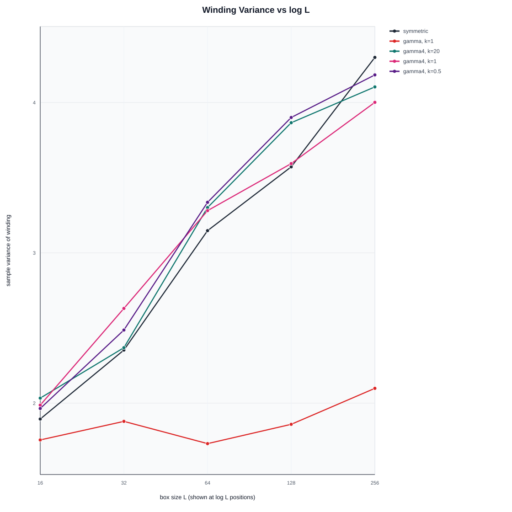
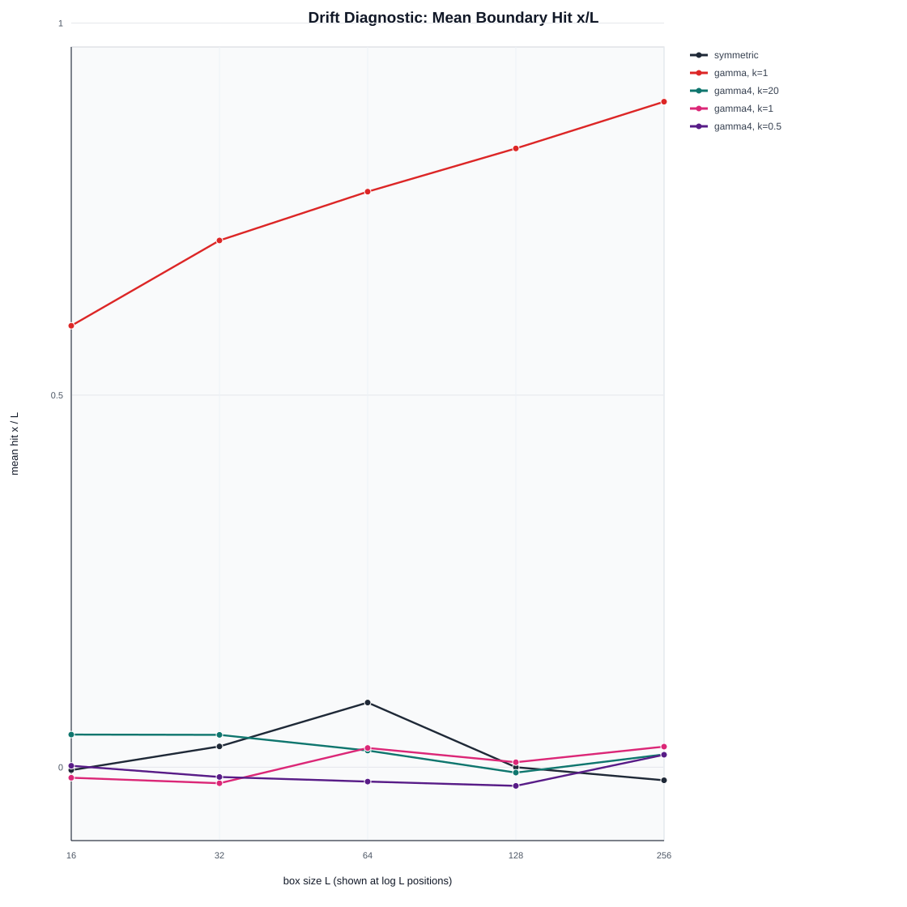
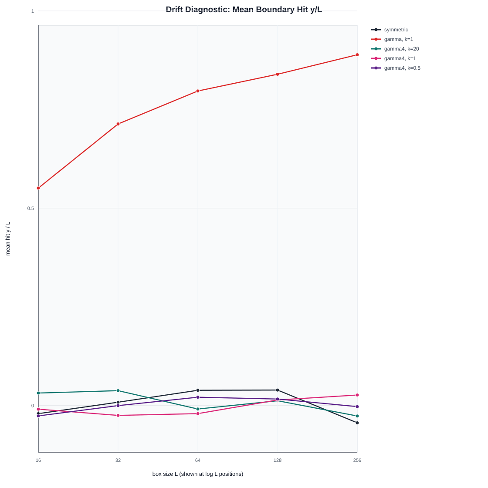
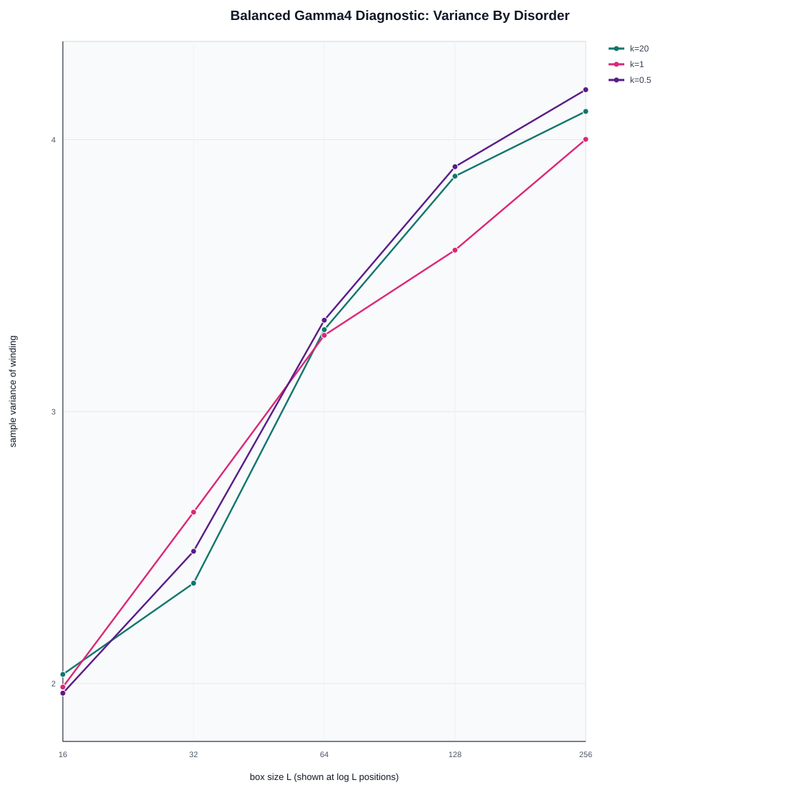

# Numerical Experiments on Winding of Loop-Erased Random Walks in Fixed Random Environments

Alberto Rescigno

## Abstract

We study the winding of loop-erased random walks from the origin to the boundary of a square box in two-dimensional lattice random environments. In the symmetric case, the winding variance is expected to grow logarithmically with the box size. Motivated by a proposed random-environment extension of the uniform spanning tree model, we implement fixed site-dependent transition probabilities generated from positive edge weights and compare the observed winding variance against `C log L` and `C(log L)^2` scaling forms. Our simulations reproduce the expected qualitative logarithmic growth in the symmetric baseline. For the two-random-weight model `w_N = w_E = 1`, `w_S = u`, `w_W = v`, we find substantial effective north-east drift after normalisation, especially for moderate and strong disorder. This drift shortens walks and suppresses winding variance growth. As a balanced diagnostic, we also simulate a four-random-weight model with independent mean-one Gamma weights in all directions; this model remains centred and shows variance growth broadly comparable to the symmetric baseline for `L <= 256`. These results suggest that drift diagnostics are essential before interpreting random-environment winding simulations as evidence for anomalous scaling.

## 1. Introduction

Uniform spanning trees and loop-erased random walks are closely related objects in two-dimensional probability. Wilson's algorithm samples a uniform spanning tree by repeatedly running random walks and erasing their loops, and the branch of a uniform spanning tree from a point to the boundary has the distribution of a loop-erased random walk. This makes loop-erased random walk a natural object for numerical study when the observable of interest is a single branch rather than an entire tree.

The observable considered here is the winding of the loop-erased path from the centre of a square box to the boundary. On the square lattice, we define winding as the number of left turns minus the number of right turns made by the loop-erased path. In the ordinary symmetric model, where each nearest-neighbour step has probability `1/4`, the variance of this winding is expected to grow like `C log L`, where `L` is the box size.

The purpose of this project is to explore what happens when the random walk is placed in a fixed site-dependent random environment. The motivating question is whether spatial disorder can increase the winding fluctuations, possibly producing variance growth closer to `C(log L)^2`. This question is numerical and exploratory: the simulations here are designed to identify plausible behaviour and modelling issues, not to prove an asymptotic theorem.

## 2. Model And Observable

We work on the square box

```text
B_L = [-L, L]^2 intersect Z^2
```

and start the walk at the origin. The walk is stopped when it first hits the boundary of the box. The resulting path is loop-erased chronologically, and the winding of the loop-erased path is computed as

```text
W_L = number of left turns - number of right turns.
```

The baseline model is the simple symmetric random walk. The main random-environment model assigns outgoing edge weights at each site:

```text
w_N = 1
w_E = 1
w_S = u_x
w_W = v_x
```

where `u_x` and `v_x` are independent positive mean-one random variables. In the simulations below, they are sampled from `Gamma(k, 1/k)`, so that the mean is `1` and the variance is `1/k`. The transition probabilities are obtained by normalising the four outgoing weights.

Because this two-weight model can introduce directional bias after normalisation, we also study a balanced diagnostic model in which all four outgoing weights are sampled independently:

```text
w_N, w_E, w_S, w_W iid Gamma(k, 1/k).
```

This second model is not presented as the original proposed model, but as a diagnostic control for separating random-environment effects from effective drift.

## 3. Numerical Method

For each model, disorder level, and box size, we repeat the following procedure:

1. Sample a fixed environment.
2. Run a random walk from the origin until it hits the boundary.
3. Loop-erase the path.
4. Compute its winding.
5. Record the raw walk length, loop-erased length, winding, and boundary hit location.

The focused run uses

```text
L = 16, 32, 64, 128, 256
k = 20, 1, 0.5
700 samples per model/size/disorder cell
```

The boundary hit location is used as a drift diagnostic. A centred model should have mean hit coordinates close to zero after normalisation by `L`.

## 4. Symmetric Baseline

The symmetric baseline shows the expected qualitative growth of winding variance.

| L | Var(W) | mean raw steps | mean LERW steps |
|---:|---:|---:|---:|
| 16 | 1.894 | 296.9 | 40.3 |
| 32 | 2.353 | 1239.1 | 96.2 |
| 64 | 3.148 | 4861.2 | 231.8 |
| 128 | 3.572 | 20045.7 | 559.1 |
| 256 | 4.300 | 77271.2 | 1329.5 |

The fit against `log L` gives `R^2 = 0.992`, compared with `R^2 = 0.987` for the fit against `(log L)^2`. This does not prove the asymptotic law, but it gives a useful calibration: the simulation pipeline is capable of reproducing the known logarithmic behaviour qualitatively.



## 5. Two-Weight Gamma Model

The two-weight Gamma model exhibits strong effective drift after normalisation. At `L = 256`, the mean boundary hit locations are:

| k | mean hit x/L | mean hit y/L |
|---:|---:|---:|
| 20 | 0.589 | 0.591 |
| 1 | 0.894 | 0.889 |
| 0.5 | 0.916 | 0.918 |

Thus, for `k = 1` and `k = 0.5`, the walks overwhelmingly exit near the north-east corner. This is visible both in the boundary hit plot and in the raw walk lengths, which are much shorter than in the symmetric and balanced models.





The winding variance in the drifted cases is correspondingly suppressed. For `k = 0.5`, the variance increases only from `1.358` at `L = 16` to `1.548` at `L = 256`. This is consistent with the warning that genuine drift may lead to finite winding variance.

## 6. Balanced Gamma4 Diagnostic

The balanced four-weight model remains centred. At `L = 256`, the mean hit locations are close to zero:

| k | mean hit x/L | mean hit y/L |
|---:|---:|---:|
| 20 | 0.017 | -0.027 |
| 1 | 0.028 | 0.026 |
| 0.5 | 0.017 | -0.003 |

The winding variance grows with `L` for all three disorder levels:

| k | Var(W), L=16 | Var(W), L=256 |
|---:|---:|---:|
| 20 | 2.034 | 4.104 |
| 1 | 1.987 | 4.001 |
| 0.5 | 1.965 | 4.184 |

Over the range `L <= 256`, these curves are closer to logarithmic growth than to a clear `(log L)^2` law. The evidence is therefore not sufficient to support anomalous winding variance in this balanced diagnostic model.



## 7. Discussion

The main lesson from the simulations is that mean-one edge weights do not by themselves guarantee a drift-free transition kernel. In the two-weight model, the fixed weights in the north and east directions and the random weights in the south and west directions produce a strong north-east exit bias after normalisation. This effect is strongest for smaller Gamma shape parameter `k`, where the disorder is stronger.

This matters for the original winding question. If the random walk has a genuine effective drift, then the branch reaches the boundary more directly and its winding variance may remain bounded or grow much more slowly. Such a model is not testing the same phenomenon as a centred random environment that might produce enhanced winding fluctuations.

The balanced four-weight diagnostic avoids this directional bias and gives a cleaner comparison. In the tested range, however, it does not show convincing evidence of `(log L)^2` growth. Larger sizes, larger sample counts, and possibly a variance decomposition into within-environment and between-environment components would be needed before drawing stronger conclusions.

## 8. Conclusion

These simulations identify effective drift as a central modelling issue in random-environment LERW winding experiments. The exact two-weight Gamma model produces strong directional exit bias for moderate and strong disorder, suppressing winding variance growth. A balanced four-weight diagnostic remains centred and displays variance growth broadly comparable to the symmetric baseline up to `L = 256`. Before using larger simulations to test the conjectured `C(log L)^2` law, the intended drift-free random-environment model should be clarified.

